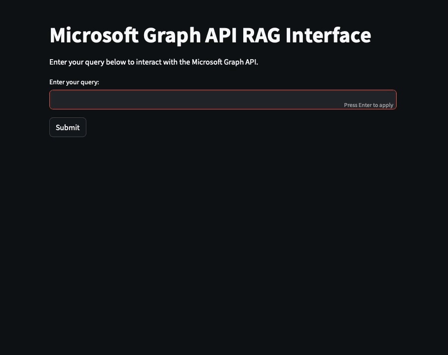
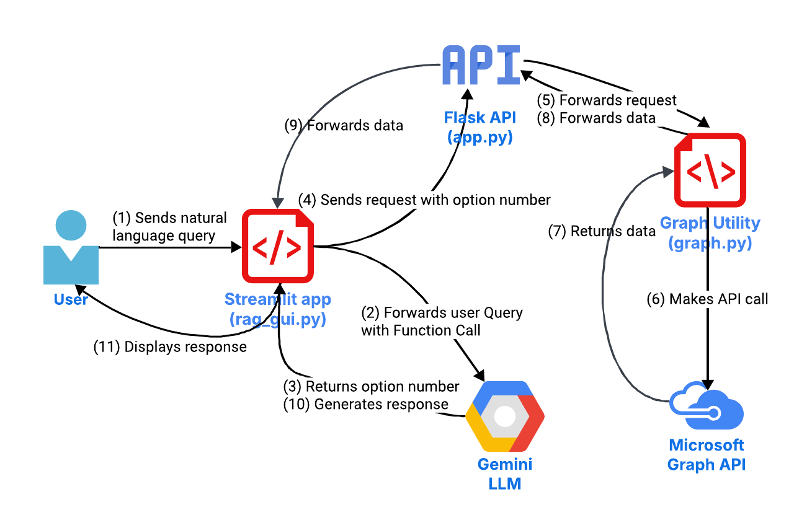

# Microsoft Graph AI Assistant

Transform the way you interact with your Microsoft 365 data! This AI-powered assistant lets you chat naturally with your emails, calendar events, and contacts, all through a simple and intuitive interface. Whether you're summarizing your inbox, checking your meetings, or finding important SharePoint files, this app brings the power of AI to your Microsoft 365 workflow. Built with cutting-edge Retrieval-Augmented Generation (RAG) and function calling, it’s your personal assistant for smarter and faster productivity.

<p align="center">
  
</p>

## High-Level Description

### Components:

1. User (Frontend)
   - Interacts with the rag_gui.py Streamlit app.
   - Sends natural language queries.

2. Streamlit App (rag_gui.py)
   - Receives user queries.
   - Determines if the query requires a Graph API call using Gemini 1.5 Flash.
   - Calls the appropriate function (e.g., `list_inbox`, `extract_contacts`, etc.).

3. Flask REST API (app.py)
   - Exposes REST endpoints for interacting with the Microsoft Graph API.
   - Receives requests from rag_gui.py and forwards them to graph.py.

4. Graph Utility Script (graph.py)
   - Implements direct calls to the Microsoft Graph API.
   - Handles authentication (app-only) and data retrieval.

5. Microsoft Graph API
   - Provides access to Microsoft 365 data (emails, calendar events, contacts, SharePoint sites, etc.).

6. Gemini LLM (RAG Logic)
   - Processes the retrieved data and generates a natural language response using Gemini 2.0 Flash.
   - Sends the response back to the user via rag_gui.py.

---

### Flowchart

<p align="center">
  
</p>

---

### Workflow Steps:

1. User Query:
   - The user enters a natural language query in the Streamlit app (e.g., "List my inbox emails from the last week").

2. Function Calling:
   - rag_gui.py uses Gemini 1.5 Flash to determine if the query requires a Graph API call.
   - If yes, it maps the query to the appropriate function (e.g., `list_inbox`).

3. REST API Call:
   - rag_gui.py sends a request to the Flask REST API (`app.py`) with the corresponding option number (e.g., `option=2` for `list_inbox`).

4. Graph API Interaction:
   - app.py forwards the request to graph.py, which makes the actual call to the Microsoft Graph API.
   - The Graph API retrieves the requested data (e.g., inbox emails).

5. Data Processing:
   - The retrieved data is sent back to rag_gui.py via app.py.

6. RAG Response Generation:
   - rag_gui.py uses Gemini 2.0 Flash to generate a natural language response based on the retrieved data and the user query.

7. Response Display:
   - The response is displayed to the user in the Streamlit app.

---

## Application Setup using Docker

This guide provides instructions for:
1. **Building the Docker Images Locally** (_e.g building the application_).
2. **Pulling and Running the Images** using Docker Compose (_e.g using the application_).

---

## **1. Developer Perspective: Build the Application Locally**

Follow these steps to build the Docker images on your local machine.

### **Prerequisites**
- Docker installed on your machine.

### **Steps**

1. **Build the Docker Images**:
   - Build the `flask-api` image:
     ```bash
     docker build --platform linux/amd64 -t flask-api -f Dockerfile.flask .
     ```
   - Build the `streamlit-gui` image:
     ```bash
     docker build --platform linux/amd64 -t streamlit-gui -f Dockerfile.streamlit .
     ```

2. **Verify the Images on Docker**:
   - Run the command below in your terminal window:
     ```bash
     docker images
     ```
   - Ensure the images `flask-api` and `streamlit-gui` are listed.

---

## **2. User Perspective: Run the Application**

Follow these steps to pull and run the Docker images using Docker Compose.

### **Prerequisites**
- Docker and Docker Compose installed on the target machine.
- A `docker-compose.yml` file (provided below if you want to use the pre-existing images from Docker Hub).
- The Configuration File (`config.cfg`).

The application requires a `config.cfg` file for secrets (e.g., Azure App registration, Gemini API key). This file is mounted into the containers using a volume.

### **Creating `config.cfg`**

#### **Option 1: Use `configure_app.py` to Auto-Generate `config.cfg`**

1. **Run the Configuration Script**:
   - Execute the following command to run the `configure_app.py` script:
     ```bash
     python configure_app.py
     ```
   - Follow the prompts to input your Azure App registration details and Gemini API key.

2. **Verify the File**:
   - A `config.cfg` file will be created in the current directory with the provided details.

#### **Option 2: Manually Create `config.cfg`**

1. **Create the File**:
   - Create a file named `config.cfg` in the same directory as `docker-compose.yml`.

2. **Add the Following Content**:
   - Replace placeholders with actual values:
     ```
     [azure]
     clientId = your-client-id
     clientSecret = your-client-secret
     tenantId = your-tenant-id
     userId = your-user-id

     [gemini]
     google_api_key = your-gemini-api-key
     ```

### **To Run the Application**

1. **Create a `docker-compose.yml` File**:
  - If you have built your own Flask and Streamlit Docker images by following the above steps, create a file named `docker-compose.yml` with the following content:
     ```yaml
        version: '3.8'

        services:
          flask_api:
            platform: linux/x86_64
            image: flask-api
            container_name: flask_api
            environment:
              - FLASK_ENV=development
              - FLASK_RUN_HOST=0.0.0.0
            ports:
              - "5001:5000"
            volumes:
              - ./config.cfg:/app/config.cfg
            networks:
              - app-network

          streamlit_gui:
            platform: linux/x86_64
            image: streamlit-gui
            container_name: streamlit_gui
            environment:
              - FLASK_RUN_HOST=0.0.0.0
              - BASE_URL=http://flask_api:5000
            ports:
              - "8501:8501"
            volumes:
              - ./config.cfg:/app/config.cfg
            depends_on:
              - flask_api
            networks:
              - app-network

        networks:
          app-network:
            driver: bridge
     ```

  - **Alternatively**: If you haven't built your own Flask and Streamlit Docker images following the above steps, you can simply use the `docker-compose.yml` file in this repository to pull the pre-existing images from Docker Hub as in step 2 below.

2. **Pull the Images**:
   - Run the following command to pull the images from Docker Hub:
     ```bash
     docker-compose pull
     ```

3. **Run the Containers**:
   - Start the containers in detached mode:
     ```bash
     docker-compose up -d
     ```

4. **Access the Services**:
   - **Flask REST API**: Accessible at `http://localhost:5000`.
   - **Streamlit GUI**: Accessible at `http://localhost:8501`.

5. **Stop the Containers**:
   - When you’re done, stop the containers:
     ```bash
     docker-compose down
     ```

---

## **Troubleshooting**

1. **Permission Denied (Only if you want to push your Docker images to Docker Hub)**:
   - Ensure you’re logged in to Docker Hub (`docker login`).
   - Verify the repository name and tag are correct.

2. **Port Conflicts**:
   - Ensure ports `5001` (Flask) and `8501` (Streamlit) are not in use.

3. **Missing `config.cfg`**:
   - Ensure the `config.cfg` file exists and is correctly formatted.

---

## **Repository Structure**

```
msgraph_ai_assistant/
├── Dockerfile.flask
├── Dockerfile.streamlit
├── docker-compose.yml
├── config.cfg   #You have to create this.
├── configure_app.py   #Use this to create config.cfg
├── app.py
├── rag_gui.py
└── requirements.txt
```

---

## **Contact**

For questions or issues, contact [Ahmad Ammari](mailto:ammariect@gmail.com).
